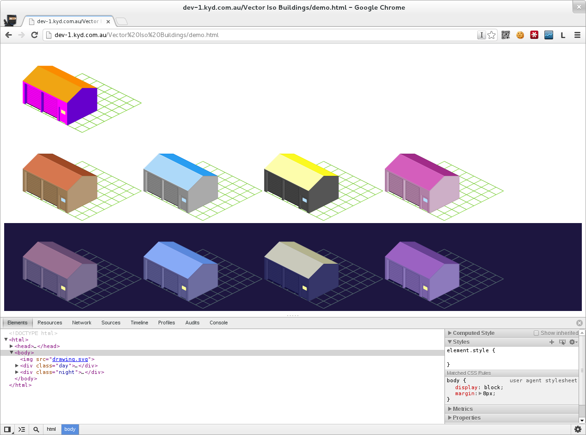

A SVG recolouration demo, showing the power of vector graphics.

# What is it?

SVG is an XML-based vector graphics language. This makes it easy for us
to manipulate attributes such as individual colours and lines within the
graphic.

This demo manipulates a SVG using a particular colour map in order to
create many colour variations of the same sprite. Furthermore, the demo
manages a filter over the overall colours in order to create night and
day variations.

